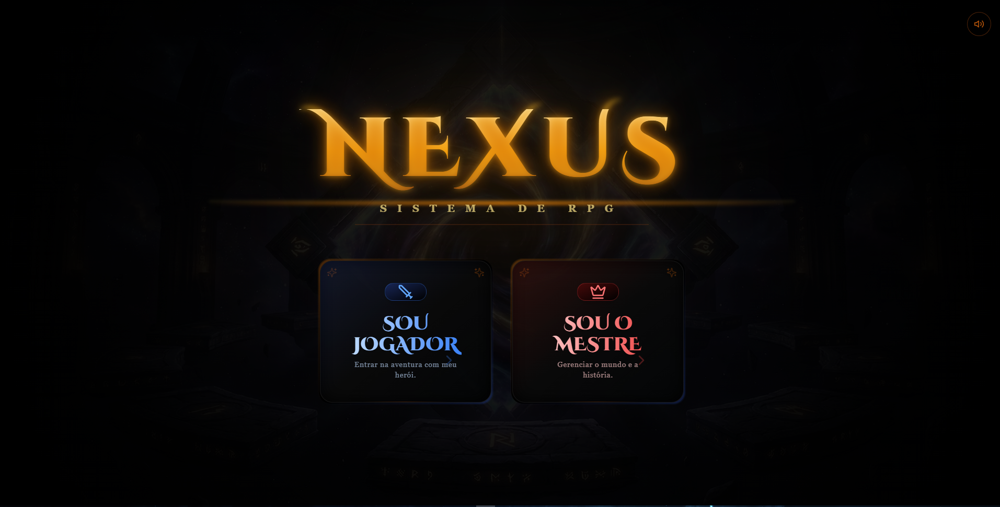

# ⚔️ Nexus RPG - Virtual Tabletop

<div align="center">
  <a href="https://nexusrpg.vercel.app/"></a>
  <a href="https://reactjs.org/"></a>
  <a href="https://www.typescriptlang.org/"></a>
  <a href="https://socket.io/"></a>
  <a href="https://tailwindcss.com/"></a>

  <h3><b><a href="https://nexusrpg.vercel.app/">🎲 JOGUE AGORA: nexusrpg.vercel.app</a></b></h3>
</div>

<br/>

<div align="center">
  
  <p><i>O portal de entrada: escolha forjar o mundo como Mestre ou desbravar a história como Herói..</i></p>
</div>

<br/>

O **Nexus RPG** é uma plataforma VTT (*Virtual Tabletop*) moderna e imersiva, focada em trazer a melhor experiência de **Dungeons & Dragons 5e** para o navegador. Desenvolvido para mestres que exigem controle total do cenário e jogadores que buscam o máximo de imersão visual.

---

## 🐲 Funcionalidades Principais

### 🌌 Imersão Visual & Combate
* **Dados 3D Realistas:** Rolagens de D20 integradas com física via `Three.js` e `Matter.js` (no melhor estilo Baldur's Gate 3).
* **Fila de Iniciativa Inteligente:** Solicite rolagens de múltiplos alvos simultaneamente. Os jogadores rolam em suas telas e o mestre processa a fila de NPCs de forma fluida.
* **Sistema de Dano Visceral:** Overlay de impacto 2D com animações de sangue e cura, calculando automaticamente a vida dos tokens.
* **Grid de 1,5m (5ft):** Mapa esquadrinhado e sincronizado para medições táticas precisas.

<br/>

<div align="center">
  
  <p><i>Exemplo de combate tático com tokens, mira central e menu radial.</i></p>
</div>

<br/>

### 🗺️ Gestão de Mapa (DM Tools)
* **Fog of War Dinâmico:** Revele salas ou esconda perigos usando pincéis, retângulos ou calculando linhas de visão.
* **Ambientação Global:** Controle de iluminação em tempo real (Dia/Noite/Crepúsculo) que afeta instantaneamente a tela de todos.
* **Régua de Medição:** Ferramentas de medição de deslocamento (com limite visual de 9m) e alcance livre.
* **Áreas de Efeito (AoE):** Desenhe círculos, cones e cubos perfeitos para calcular quem será atingido por aquela *Bola de Fogo*.

### 🔊 Sincronização & Áudio
* **Real-time Sync:** Movimentação de tokens, pings de alerta e chat sincronizados com latência zero via WebSockets.
* **Soundboard Integrado:** Músicas de ambiente e efeitos sonoros (SFX) disparados pelo Mestre que tocam para toda a mesa.
* **Chat Avançado:** Comandos nativos de rolagem (ex: `/r 1d20+5`), sussurros privados (`/w`) e logs de combate automáticos.

---

## 🛠️ Tecnologias Utilizadas

A forja do Nexus foi construída com as ferramentas mais poderosas do ecossistema web atual:

* **Frontend:** [React.js](https://reactjs.org/) + [Vite](https://vitejs.dev/)
* **Linguagem:** [TypeScript](https://www.typescriptlang.org/) *(Tipagem estrita para garantir a segurança dos dados da campanha)*
* **Estilização:** [Tailwind CSS](https://tailwindcss.com/)
* **Comunicação Real-time:** [Socket.io](https://socket.io/)
* **Engine Gráfica (2D/3D):** Canvas API, [Three.js](https://threejs.org/) e [Matter.js](https://brm.io/matter-js/)
* **Engine de Áudio:** [Howler.js](https://howlerjs.com/)

---

## 🚀 Como Executar o Projeto Localmente

### Pré-requisitos
* Node.js (v18 ou superior)
* NPM ou Yarn

### Instalação

1. Clone este repositório:
```bash
git clone [https://github.com/jonvicttor/Nexus-RPG.git](https://github.com/jonvicttor/Nexus-RPG.git)
